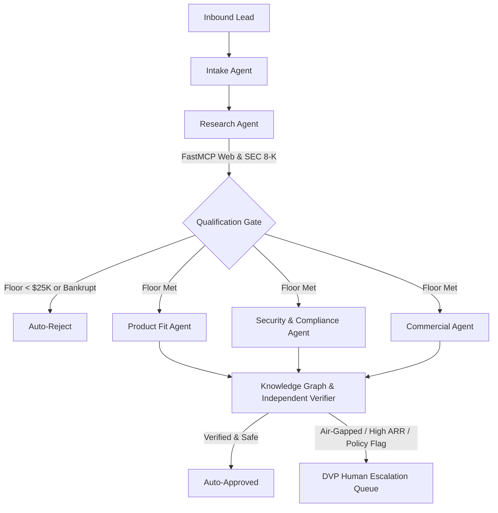

# NOTCRM

**Autonomous AI Lead Qualification & Revenue Governance Engine**

[-emerald)](tests/test_notcrm_suite.py)
[](LICENSE)
[](https://www.python.org/)
[](https://fastapi.tiangolo.com)
[](https://github.com/jlowin/fastmcp)
[](https://opentelemetry.io/)

NOTCRM is an enterprise-grade AI lead qualification and revenue governance platform. It automates inbound sales qualification using a deterministic 7-agent Directed Acyclic Graph (DAG) architecture, Model Context Protocol (FastMCP) tool servers, Agent-to-Agent (A2A) message passing, continuous Knowledge Graph memory, and rigorous evaluation contracts.

---

## 🏗️ Architecture Overview



### The 7 Specialized Agents

| Agent | Role | FastMCP Tools | Primary Function |
| :--- | :--- | :--- | :--- |
| **1. Lead Intake** | Input Sanitation & Schema Guard | `crm_mcp` | Validates firmographic schema contracts, sanitizes injection payloads, and enforces type invariants. |
| **2. Research** | Live Web & SEC Intelligence | `web_enrichment`, `sec_8k` | Scans market news, stock volatility, and SEC 8-K filings for bankruptcy (Chapter 11) or acquisition signals. |
| **3. Qualification** | Solvency & Revenue Floor | `crm_mcp` | Short-circuits cold leads below \$25K ARR or insolvent prospects before expensive parallel evaluations. |
| **4A. Product Fit** | Roadmap & Technical Alignment | `kb_mcp` | Evaluates prospect technical requirements against product capabilities and custom connector roadmaps. |
| **4B. Security** | Multi-Framework Regulatory Audit | `security_mcp` | Audits SOC2 Type II, FedRAMP, GDPR, HIPAA, PCI-DSS v4, and SOX 404 compliance posture per industry. |
| **4C. Commercial** | Pricing, Margins & ARR Valuation | `crm_mcp` | Computes risk-adjusted ARR tiers, margin safety, and discount authority constraints. |
| **5. HITL Gate** | Multi-Signal Fusion & Verifier | `knowledge_graph` | Fuses parallel agent signals, cross-checks raw evidence against policy invariants, and routes to DVP. |

---

## 🧠 Core Subsystems

### 1. Model Context Protocol (FastMCP) Decoupling
Agents never access underlying databases directly. FastMCP tool servers (`crm_mcp.py`, `kb_mcp.py`, `security_mcp.py`) provide typed, schema-validated tool contracts over stdio/HTTP transports. Swapping CRM backends (e.g., Salesforce to HubSpot) requires zero changes to agent logic.

### 2. Enterprise Brain Knowledge Graph Memory (`networkx` + `D3.js`)
Past deal outcomes are committed to an immutable knowledge graph (`Entity ➔ Policy ➔ Decision ➔ Outcome`). The engine dynamically detects repeat churn patterns (>50% historical churn) and surfaces advisory warning badges to the DVP before commitment.

### 3. DVP Fleet Hiring & Unit Economics
- Configure each agent by hiring from **Meticulous**, **Balanced**, and **Fast** candidate archetypes.
- Enforce a **\$1.00 Compute Budget** per deal with live scaled projections across 1,000 inbound leads (Token compute spend, Pipeline ARR unlocked, Hallucination risk exposure, and Human review burden).

### 4. Continuous Evaluation & Governance Lab
- **Evaluation Contract (E1)**: 4 metric classes (Business Outcome, Agent Quality, System Performance, Governance & Safety).
- **Golden Benchmark Dataset (E2)**: Curated benchmark cases across 6 failure taxonomies.
- **Component Evals (E3)**: Isolated pass rates per agent for pinpointing regressions.
- **Trajectory Scorecard (E4)**: Process quality scoring with penalties for unsafe or hallucinated tool sequences.
- **Independent Verifier (E5)**: Deterministic Claim $\to$ Evidence $\to$ Policy checks ahead of LLM consensus.
- **Regression Harness (E6)**: Multi-variant A/B benchmarking (Baseline vs. Hardened vs. Governed).
- **Governance & Red-Teaming (G1-G3)**: Deterministic policy engine invariants, prompt injection defense, and regulatory matrix.

---

## 🚀 Quick Start (Local Development)

### 1. Prerequisites
- Python 3.11+
- Git

### 2. Installation

```bash
# Clone the repository
git clone https://github.com/mangoman2049/enterprise-agentic-decision-graph.git
cd enterprise-agentic-decision-graph

# Create and activate virtual environment
python -m venv .venv
# On macOS/Linux:
source .venv/bin/activate
# On Windows:
.venv\Scripts\activate

# Install dependencies
pip install -r requirements.txt
```

### 3. Launch Server

```bash
python app.py
```

Open your browser at **`http://127.0.0.1:8000/`**.

---

## 🧪 Automated Testing & QA Harness

NOTCRM enforces a strict **0-Regression Policy** with 59 automated test scenarios covering multi-session isolation, vertical switching, DOM hierarchy, and browser flows:

```bash
# Run all 59 tests
python run_tests.py

# Or run via unittest discovery
python -m unittest discover -s tests
```

---

## 🌐 Free Cloud Hosting & Deployment Guide

NOTCRM can be deployed for free across multiple cloud platforms.

### Option 1: Render.com (Recommended for Free Python Services)
Render offers free cloud web services with native Python 3.11 support, persistent FastAPI processes, and automatic HTTPS subdomains (`your-app.onrender.com`).

1. Push your repository to GitHub: `https://github.com/mangoman2049/enterprise-agentic-decision-graph`.
2. Log in to [Render.com](https://render.com/) and click **New + ➔ Web Service**.
3. Connect your GitHub repository.
4. Render will automatically detect `render.yaml`:
   - **Environment**: `Python 3`
   - **Build Command**: `pip install -r requirements.txt`
   - **Start Command**: `uvicorn app:app --host 0.0.0.0 --port $PORT`
5. Click **Create Web Service**. Your live URL will be ready in ~2 minutes.

---

### Option 2: Hugging Face Spaces (Free Cloud Docker Runtime)
Hugging Face Spaces provides 100% free CPU hardware (16GB RAM, 2 vCPU) with persistent Docker container execution.

1. Go to [Hugging Face Spaces](https://huggingface.co/spaces) and click **Create new Space**.
2. Set **Space SDK** to **Docker** (Blank).
3. Connect your GitHub repository or push directly to the HF Space Git remote.
4. The included `Dockerfile` will automatically build and launch the application on port 7860/8000.

---

### Option 3: Railway.app / Fly.io (Containerized Free Trial Tier)
Deploy anywhere using the included production `Dockerfile`:

```bash
# Using Railway CLI
railway login
railway init
railway up

# Using Fly.io CLI
fly launch
fly deploy
```

---

### Option 4: Vercel (Serverless Deployment)
Vercel is optimized for frontend and serverless edge functions. A `vercel.json` configuration is included:

1. Import the repository in [Vercel](https://vercel.com/).
2. Set the framework preset to **Other**.
3. Deploy. *Note*: Serverless runtimes have a 10–15s execution timeout per request. For long-running simulation workloads, Render or Hugging Face Spaces is recommended.

---

### Option 5: Docker Container (Local / Self-Hosted VPS)

```bash
# Build Docker image
docker build -t notcrm .

# Run container
docker run -p 8000:8000 notcrm
```

---

## 📁 Repository Structure

```text
├── AGENTS.md                  # Principal software engineering guidelines & architectural rules
├── Dockerfile                 # Production multi-stage Docker container specification
├── Procfile                   # Process file for Heroku / Railway deployment
├── README.md                  # Repository documentation
├── render.yaml                # Render.com Infrastructure-as-Code blueprint
├── requirements.txt           # Python package dependencies
├── run_tests.py               # Automated regression harness runner
├── vercel.json                # Vercel serverless ASGI routing configuration
├── app.py                     # FastAPI application entry point & multi-session lifecycle
├── agents/                    # 7 specialized DAG agent implementations
│   ├── base_agent.py          # Base agent class with telemetry instrumentation
│   ├── agent_roster.py        # 21 candidate profiles across 3 archetypes
│   └── ...                    # Intake, Research, Qualification, Security, etc.
├── mcp_servers/               # FastMCP tool servers (CRM, KB, Security)
├── evals/                     # Week 1 Evaluation & Verification harness
├── knowledge_graph/           # Enterprise Brain NetworkX & D3 graph memory
├── static/                    # Frontend single-page application (HTML/CSS/JS)
│   └── index.html             # Responsive Notion-style 6-tab workbench
├── docs/                      # Technical documentation & downloadable lead datasets
└── tests/                     # Automated QA and integration test suites (59 tests)
    ├── test_notcrm_suite.py   # Core subsystem integration tests
    └── test_qa_browser_flows.py # End-to-end browser flow & DOM hierarchy tests
```

---

## 📄 License

This project is licensed under the [MIT License](LICENSE).
